# CPT113 Hackathon: Interactive Game Using Data Structures
## "The Vanished Voyage"
## 1.0 Game Overview
Embark on an exhilarating journey in "The Vanished Voyage", where you must fight against time to uncover the mysteries of a plane crash. On Christmas Eve, as you were heading home after a long year abroad, eager to reunite with your family, disaster struck. You awaken in a dense forest with a throbbing headache, realizing that your plane has crashed. With relentless resolve to find your way back to your loved ones, you must navigate the perilous environment, face unforeseen challenges, and ultimately, discover the path to survival and escape.

  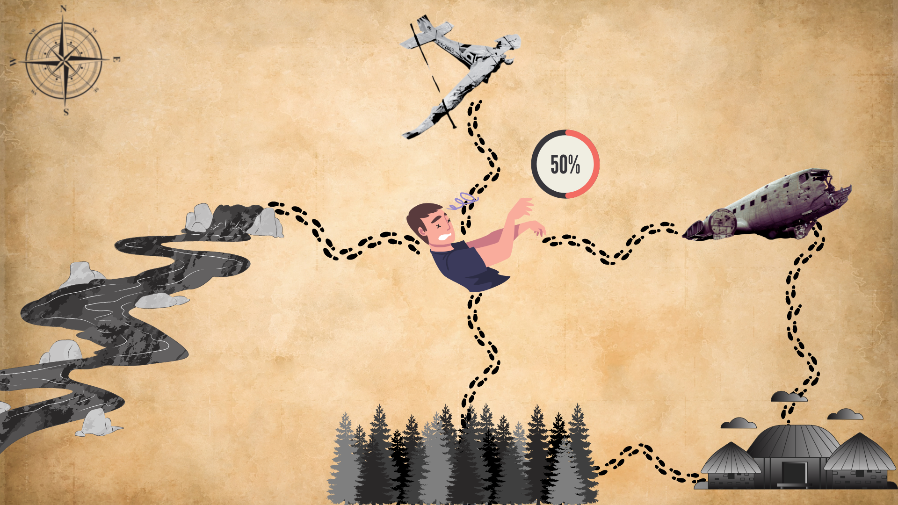
   
  <i>Figure 1.1: Map of "The Vanished Voyage"</i>

## 2.0 Game Features
Gameplay Summary:
In "The Vanished Voyage", players explore various locations, encounter events, and make choices that propel them through the story. The game uses a command-line interface, where players input commands to move, interact with the world, and manage their character. The ultimate objective is to navigate the crash site, face challenges, and find a way to escape.

1. **Rich Descriptions & Dynamic Choices:** Immerse yourself in a richly described world where every event and character is depicted in detail. The game presents critical decision points that can alter the course of the narrative, giving players the power to shape their journey and influence the outcome.

2. **Navigating the World:** The game world consists of several different areas, each identified by a unique ID. Players begin their adventure in the EmptyGround area and can move to adjacent locations by choosing one of the directions: North (N), South (S), East (E), or West (W). Invalid inputs will prompt the player to re-enter a valid direction.

3. **Event Interactions:** Each area in the game contains a set of possible events that the player can engage with. Events are randomly selected from a list of pre-programmed options, each offering a variety of outcomes such as clues, buffs, debuffs, or items. Some events may unlock hidden content and influence the story's progression, contributing to the game's multiple endings.

4. **Inventory Management:** Players will find and collect items that aid them in overcoming obstacles or advancing the story. The game includes an inventory system where items are managed in an inventoryList, allowing players to keep track of what they have collected. The use of these items plays a key role in unlocking specific events and progressing through the game.

5. **Health Tracking:** The player's health (HP) must be monitored throughout the game. Choosing the right path and avoiding unnecessary risks will help preserve HP, which is essential for survival. Strategic decisions are vital to maintaining a good health balance.

6. **Multiple Endings:** Based on the decisions made throughout the game, players can experience a variety of outcomes. This feature encourages exploration and replayability, as different paths and choices lead to distinct conclusions.

7. **Save and Load Functionality:** The game allows players to save their progress and load it later, so they can pick up where they left off. This system ensures that players can easily continue their adventure without starting over from the beginning.

## 3.0 Game Instructions

1. **Starting the Game:**
    - Begin the game by selecting whether to start a new journey or load a previous save.

2. **Character Setup:**
    - The player starts the game with 50 HP (health points) and a basic set of abilities as they regain consciousness in the EmptyGround area.

3. **Movement:**
    - To navigate the environment, players must input a direction: "North(n)", "South(s)", "East(e)", or "West(w)". Each choice leads to different regions within the crash site.

4. **Exploration and Challenges:**
    - As you explore, you'll encounter various challenges. Pay close attention to event descriptions and make decisions that could lead to success or failure.

5. **Item Collection:**
    - Throughout the game, players can gather items, which will be stored in the inventory. These items are essential for overcoming obstacles and unlocking new events.

6. **Health Monitoring:**
    - Keep an eye on your HP. If you lose all your health, the game ends in failure. Making careful choices will help you conserve health and progress further.

7. **Objective - Escape:**
    - The primary goal is to find a way out of the forest. Explore different locations and make choices that will lead to escape.

8. **Saving and Loading:**
    - You can save your progress anytime. This ensures that even if you quit the game, you can resume later from where you left off.

9. **Game Completion:**
    - The game ends when you successfully escape or when your HP reaches zero, resulting in a game over.

## 4.0 Use of Object-Oriented Programming Concepts
The game is developed using object-oriented programming (OOP) principles to create a modular and maintainable structure. Various classes and structures are utilized to represent different entities and functionalities.

1. **Classes and Objects:**
    - Several classes are defined, such as `LinkedList`, `Player`, `Area`, `EmptyGround`, ` PlaneWreck1`, `PlaneWreck2`, `River`, `Forest`, and `Village`.
    - Instances of these classes are used throughout the code, `including eventList`, `inventoryList` and areas like `ground`, `wreck1`, `wreck2`, `river`, `forest`, and `village`.

2. **Encapsulation:**
    - The game makes use of encapsulation, where related data and behavior are bundled together in classes. Access to class members is controlled through public and private access specifiers.
    - For example, the `LinkedList` class encapsulates all linked list-related functionality, while the Player class uses mutator and accessor functions to interact with private attributes.

3. **Inheritance:**
    - Inheritance is used to create derived classes that extend a base class. Classes such as `EmptyGround`, `PlaneWreck1`, `PlaneWreck2`, `River`, `Forest`, and `Village` inherit from the base class Area.
    - This inheritance allows each area to have unique behavior while maintaining common functionality, such as tracking the player’s location with an area_ID.

4. **Polymorphism:**
    - Polymorphism is demonstrated through function overriding. The `choose()` function is overridden in derived classes, allowing each area to define its own behavior when a player selects a direction.

5. **Abstraction:**
    - Abstraction hides the complexity of certain game elements. Classes like `LinkedList`, `Player`, and `Area` abstract away low-level details, allowing the developer to focus on high-level game mechanics.

6. **Templates:**
    - Templates are used in the `LinkedList` class to create a flexible data structure that works with various types, such as `Event` and `Inventory`. This enables the linked list to store diverse data types efficiently.

Overall, OOP principles like classes, objects, encapsulation, inheritance, polymorphism, abstraction, and templates are integral to organizing the game's code. These concepts enhance modularity, reusability, and maintainability, ensuring that the codebase remains clean and easy to extend.

## 5.0 Role of Linked Lists in the Game

The linked list is a crucial element in the game, playing an integral role in shaping the game's structure and facilitating key functionality such as saving and loading game progress.

A LinkedList template class is implemented to support different data types. This template is specialized for two primary types: Event and Inventory. The LinkedList template contains a nested ListNode structure, which defines each node of the list. Each node holds the data specific to its type and a pointer to the next node in the sequence.

The Event and Inventory structures define the data format for the events and inventory items stored within the linked list nodes. Each area class (e.g., PlaneWreck1, River, etc.) contains instances of `LinkedList<Event>` and `LinkedList<Inventory>` to manage the events and items that are relevant to that specific area.
Managing Events

The `LinkedList<Event>` is used to handle events in the game. The `appendNode()` method adds new events to the linked list, while the `deleteEvent()` function removes an event by its event_ID once it has been triggered. The `outputEvent()` function displays information about an event based on its event_ID, and the `eventExist()` function checks whether a specific event exists in the list.

### Managing Inventory

- For managing the player's inventory, the `LinkedList<Inventory>` specialization is employed. The `appendNode()` method adds new items to the player's inventory, and `deleteItem()` removes an item by its item_ID. The `outputItem()` function shows the details of a specific item by matching its item_ID, while the `itemExist()` function checks if an item is present in the inventory.

- The LinkedList class template provides fundamental operations such as adding and deleting nodes, displaying specific events or items, checking if events or items are present, and traversing the inventory.

### Tracking, Saving, and Loading Game Progress

- To manage the game state across different sessions, `LinkedList<Event>` is used to track the events that occur in each area. At the start of the game, the relevant events for each area are pre-loaded into the linked list. For events that are meant to occur only once, their corresponding node is removed from the list after the event is triggered. This prevents the same event from repeating during the same playthrough. The event_ID of these events is also saved to a text file, so that when the game is loaded after being closed, the system can identify and prevent these events from being triggered again.

- Similarly, `LinkedList<Inventory>` is employed to track the player's collected items. When an item is acquired, its corresponding node is appended to the inventory list. If the inventory already contains the item, the event that spawns the item will not trigger again, ensuring that the player does not receive duplicate items. The item data is written to a text file, and when the game is reloaded, the inventory is restored to its previous state by traversing the linked list and removing nodes that have already been collected.

### Here’s how the linked list functions in the game:

1. **Dynamic Data Structure:**
The linked list data structure is key to dynamically adding and removing events and inventory items in the game. When the player triggers a new event or picks up a new item, the corresponding node is added to the list with the `appendNode()` method. Conversely, when events are resolved or items are discarded, the `deleteEvent()` and `deleteItem()` methods enable the efficient removal of nodes, allowing the game state to adjust dynamically.

2. **Sequential Access:**
Thanks to the linked list’s sequential nature, events and inventory items are processed and displayed in the order they were added. For example, when the player checks the inventory using the traverseInventory() method, the items are shown in the order they were acquired. This maintains the chronological flow of the game and provides a consistent and logical display of the player's progression.

3. **Flexibility in Size:**
One of the key advantages of using linked lists is their ability to handle varying numbers of events and inventory items without requiring a fixed size. As the player advances, the linked list can easily accommodate new events and items, adding or removing elements as needed. This flexibility ensures the game can scale according to the player’s actions without being constrained by pre-set capacity limits.

4. **Efficient Element Removal:**
The `deleteEvent()` and `deleteItem()` methods demonstrate how efficiently elements can be removed from the linked list. By traversing the list and adjusting pointers, specific nodes can be removed swiftly. This is essential for keeping the game state up-to-date, managing inventory, and preserving memory, while also providing smooth gameplay transitions.

5. **Easy Traversal and Searching:**
Linked lists offer easy traversal and searching capabilities, as seen with the `traverseInventory()`, `eventExist()`, and `itemExist()` methods. The `traverseInventory()` function allows for quick iteration over the inventory, displaying each item in order. Similarly, the `eventExist()` and `itemExist()` functions facilitate fast lookups by searching through the linked list based on the event or item ID, ensuring a seamless gameplay experience.

6. **Memory Efficiency:**
Linked lists are memory-efficient because they only allocate memory when needed. In the context of the game, this means that each time a new event or item is added, a new node is created dynamically. The game can thus efficiently manage a large or small number of events and items without excessive memory consumption, promoting a smooth experience even when handling complex or lengthy gameplay.

## 6.0 Screenshots of the Game
1. When compiling the program, you will be presented with two choices: to either load your previous progress or start a new game. After making your selection, the program will display the game's map and provide you with the background story, as well as instruct you on what to do next.

    

    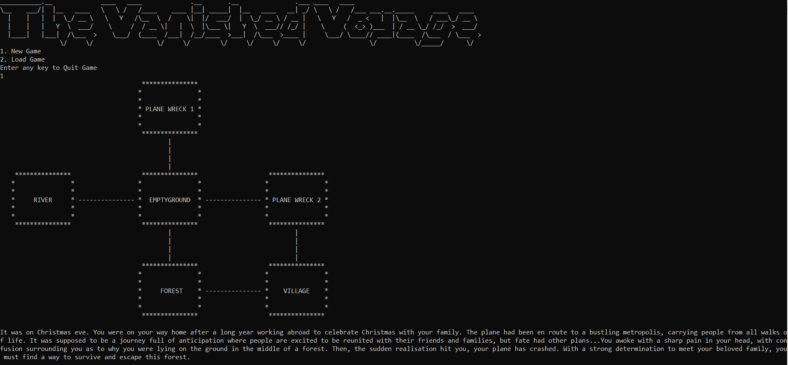
     
    <i>Figure 6.1: Map of "The Vanished Voyage" in the console</i>
    

2. Throughout the game, there are **TWO BUFFS** that you may come across: 
    a. Freshwater: This buff will increase your HP by 10 points. In this case, the original HP is 50.

    

    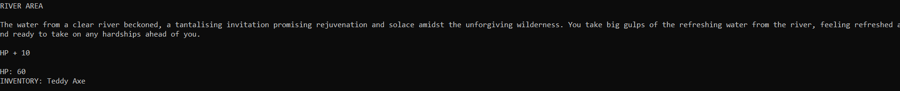
     
    <i>Figure 6.2: The Freshwater buff</i>
    

    b. Antibiotic: This buff will also increase your HP by 20 points. In this case, the original HP is 50.

    

    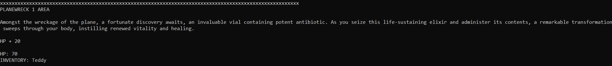
     
    <i>Figure 6.3: The Antibiotic buff</i>
    

3. Throughout the game, there are **TWO DEBUFFS** that you may come across: 
    a. Trap: This buff will decrease your HP by 10 points. In this case, the original HP is 50.

    

    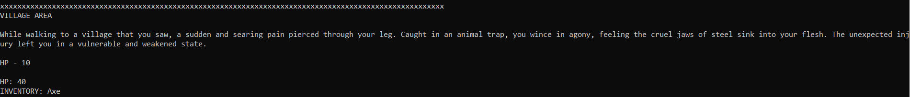
     
    <i>Figure 6.4: The Trap debuff</i>
    

    b. Snake: This buff will decrease your HP by 20 points. In this case, the original HP is 70.

    

    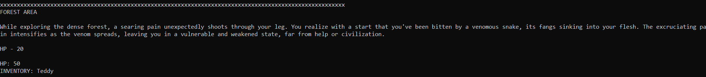
     
    <i>Figure 6.5: The Snake debuff</i>
    

4. In the game, there are **THREE ITEMS** that players can collect in their inventory: 
    a. Axe
    

    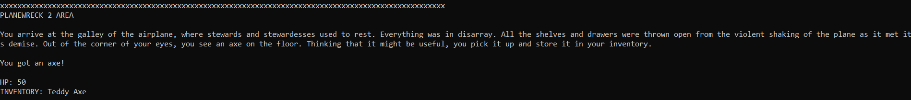
     
    <i>Figure 6.6: The Axe item</i>
    

    b. Teddy
    

    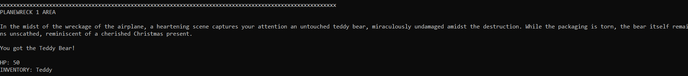
     
    <i>Figure 6.7: The Teddy item</i>
    

    c. Plank (requires the axe to obtain)
    

    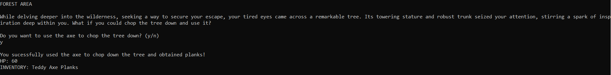
     
    <i>Figure 6.8: The Plank item</i>
    

5. **HINTS** can be obtained in the game to aid your progress.
    

    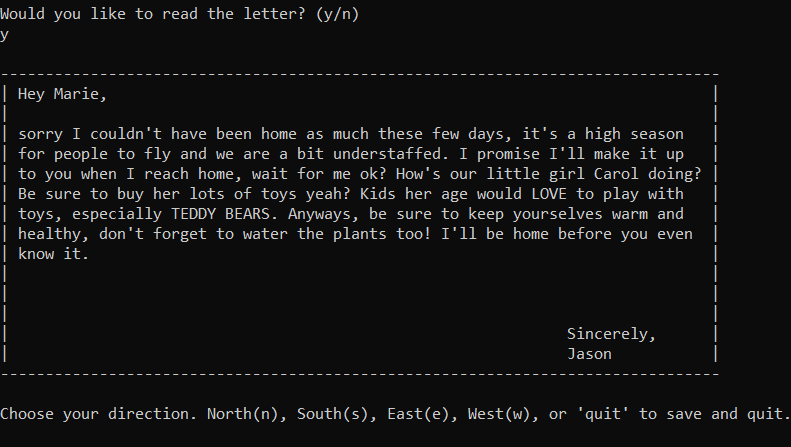
     
    <i>Figure 6.9: The Letter</i>
    

6. There are two **WINNING PATH** in the game 
    a. Building a boat to escape via the river.
    

    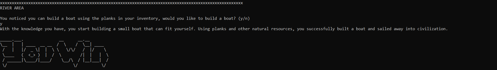
     
    <i>Figure 6.10: Win by boat</i>
    

    b. Exchanging the teddy for a radio with the villager's children.
    

    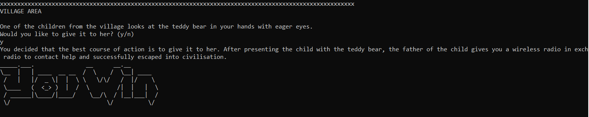
     
    <i>Figure 6.11: Win by radio</i>
    

7. **GAME OVER** when HP reaches or falls below zero.
    

    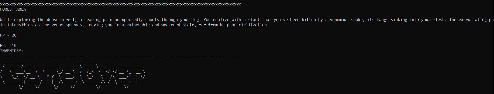
     
    <i>Figure 6.12: Game over</i>
    
